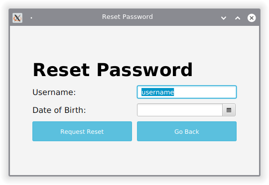

# JavaFit
This repository is based on a Fitness application written in Java.

## Table of Contents
1. [Installation](#Installation)
2. [Dependencies](#Dependencies)
3. [File Structure](#Project-File-Structure)
4. [Features](#Features)
5. [Project Showcase](#Project-Showcase)
6. [Tasks](#Tasks)


### Compatibility
**Requirements**
* *Maven 3.6.3*
* *JDK 14*


### **Installation** 
Clone the repository
```bash
$ git clone https://github.com/collinkleest/JavaFit.git
```
Change directory into JavaFit
```bash
$ cd JavaFit/
```
Install dependencies with maven.
```bash
$ mvn clean install
```
Now run the applicaiton
```bash
$ mvn clean javafx:run
```

### **Dependencies**
All dependencies are placed in the `pom.xml` file. When the Maven project is build dependencies should compile and be added into the project, therefore allowing it to run.

*JavaFX*
```xml
<dependency>
    <groupId>org.openjfx</groupId>
    <artifactId>javafx-controls</artifactId>
    <version>14</version>
</dependency>    
```

*Bootstrap Fx (Design Framework)*
```xml
<dependency>
    <groupId>org.kordamp.bootstrapfx</groupId>
    <artifactId>bootstrapfx-core</artifactId>
    <version>0.2.4</version>
</dependency>
```

*JFOENIX (Design Framework)*
```xml
<dependency>
    <groupId>com.jfoenix</groupId>
    <artifactId>jfoenix</artifactId>
    <version>9.0.8</version>
</dependency>
```

*JSON-Simple*
```xml
<dependency>
    <groupId>com.googlecode.json-simple</groupId>
    <artifactId>json-simple</artifactId>
    <version>1.1.1</version>
</dependency>
```
*MongoDB Client*
```xml
<dependency>    
    <groupId>org.mongodb</groupId>
    <artifactId>mongo-java-driver</artifactId>
    <version>3.12.2</version>
</dependency>
```

### **Project File Structure**

```
JavaFit
│   README.md
│   LICENSE    
│   pom.xml
└───src/main/java
│   │   
│   │   
│   │
│   └───com.javafit.View
│   │   │   LoginView.java
│   │   │   Register.java
│   │   |   RegistrationView.java
|   |   |   NewPassView.java
|   |   └── ResetPassView.java
│   |
|   └─── com.javafit.Model
|   |   |   Person.java
|   |   └── User.java
|   |  
|   └───com.javafit.Controller
|       |   LoginController.java
|       |   NewUserController.java
|       |   ResetController.java
|       └── SendResetController.java
└───────────────────────────────────   

```


### **Features**

* GUI Interface
* Account Login
* Weight Tracking
* Calorie Trackig
* Exercises


### Project Showcase

**Registration**


**DashBoard**


**Routines**


**Custom Routines**


**Custom Reporting**


**Account Management**


**BMI Calculator**


**Password Reset**



### Tasks
- [x] UI / UX
    - [x] Registration View
        - [x] Fields
        - [x] Checkboxes
        - [x] Accept terms and conditions
        - [x] Improve user experience
        - [x] Improve astetics
            - [x] Grid Layout, component placement
            - [x] Colors, UI overall looks better
    - [x] Login View
        - [x] Fields
        - [x] Login, Create Account button
        - [x] Improve user experience
        - [x] Improve astetics
            - [x] Colors, UI overall looks better
        - [x] Forgot Password
    - [x] Routines View
    - [x] Dashboard View
    - [x] Password Reset View
- [x] Backend
    - [x] DB
        - [x] MongoDB external DB setup
        - [x] MongoDB DB connection
        - [x] Test users in database
        - [x] routine databse
    - [x] User
        - [x] Password Hashing
        - [x] JSON
    - [x] Reset password functionality
